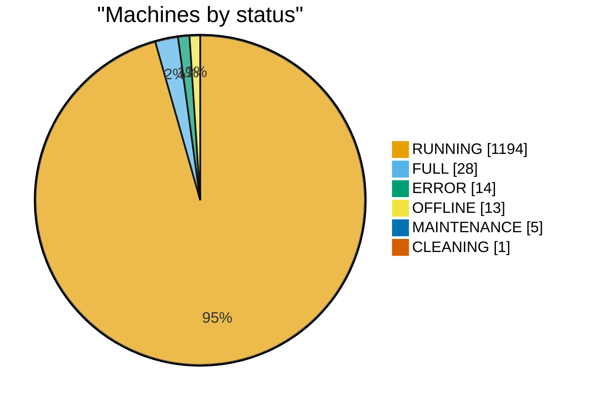
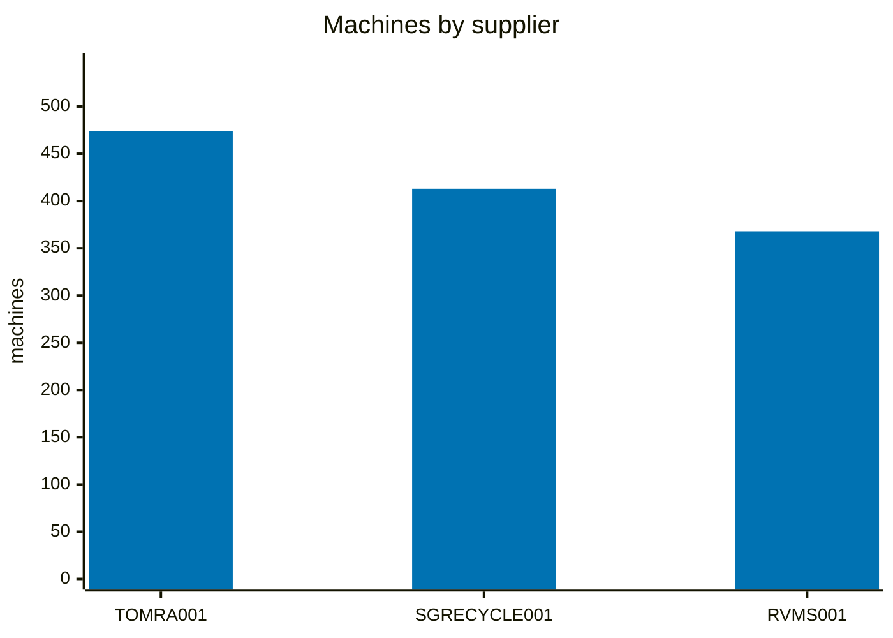
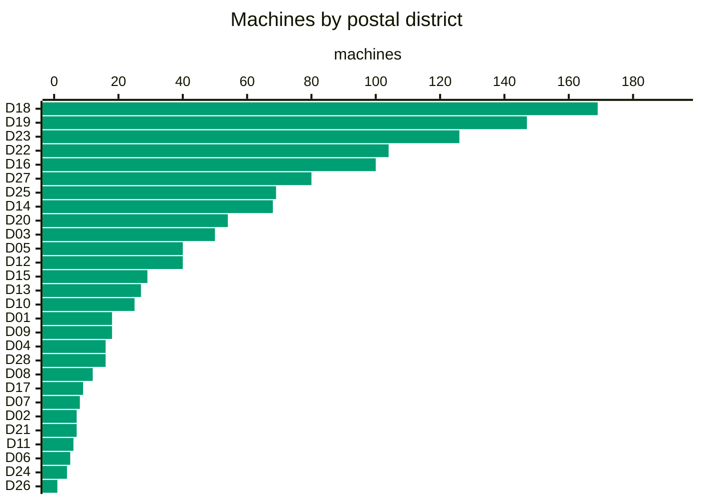
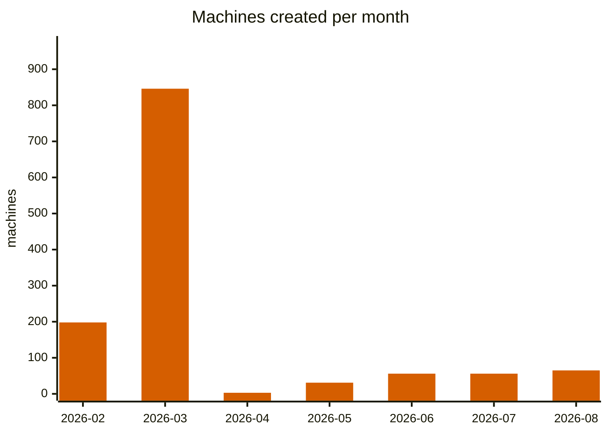
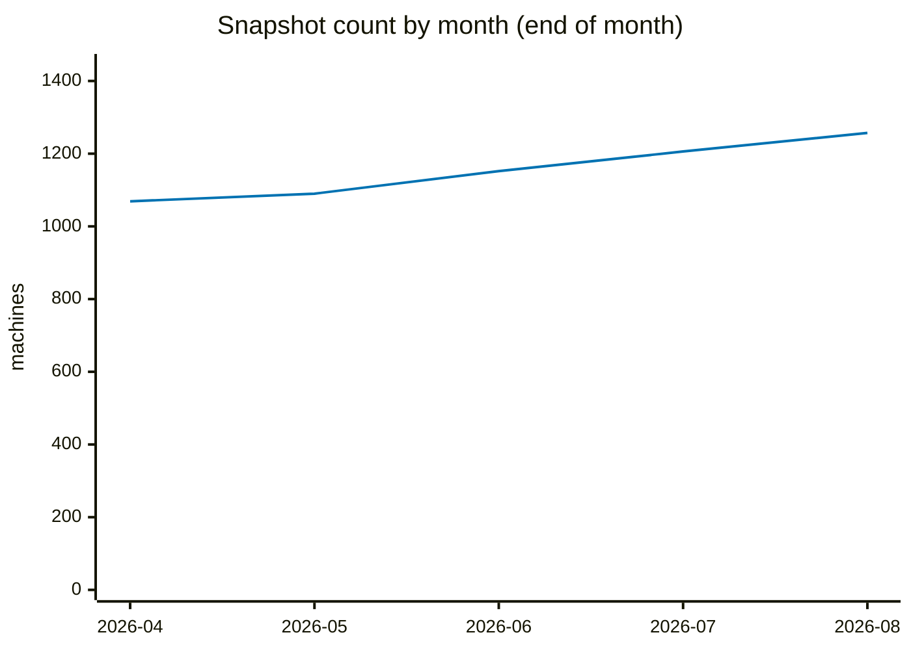
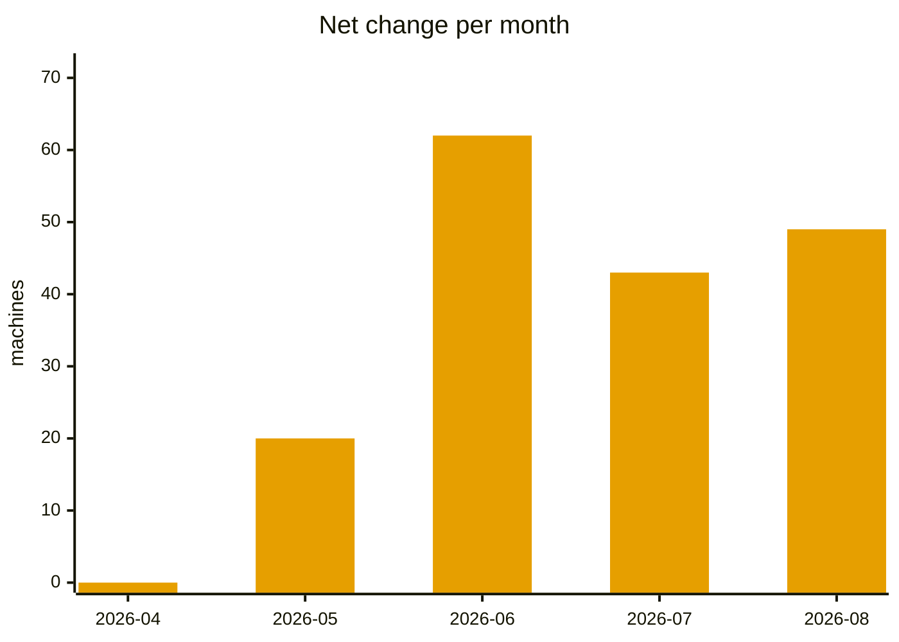

# ReturnRight data analysis

_Snapshot: **2026-08-21** · 1,255 locations · `data/latest.json` · as of 21 Aug 2026, 16:23 UTC_

## Current snapshot

| Metric | Value |
| --- | --- |
| Total locations | 1,255 |
| Unique serials | 1,255 |
| Unique postal codes | 1,214 |
| Shared postal codes | 37 postcodes host 41 extra machines |

### Status

| Status | Count | % |
| --- | --- | --- |
| RUNNING | 1,194 | 95.1% |
| FULL | 28 | 2.2% |
| ERROR | 14 | 1.1% |
| OFFLINE | 13 | 1.0% |
| MAINTENANCE | 5 | 0.4% |
| CLEANING | 1 | 0.1% |

### Supplier

| Supplier | Count | % |
| --- | --- | --- |
| TOMRA001 | 474 | 37.8% |
| SGRECYCLE001 | 413 | 32.9% |
| RVMS001 | 368 | 29.3% |

### Last connected

| Age | Count | % |
| --- | --- | --- |
| < 1 day | 1,254 | 99.9% |
| < 7 days | 1 | 0.1% |

## Operation timing (opening hours)

| Coverage | Machines | % |
| --- | --- | --- |
| 24 hours | 798 | 63.6% |
| Limited hours | 229 | 18.2% |
| Unknown | 228 | 18.2% |

### Hourly availability

- Typical window: **07:00 → 23:00**
- Earliest open: **05:30**
- Latest close: **24:00**
- Peak: **1,027 machines** at **13:00**
- **229** machines with limited hours open all 7 days

### Status by supplier

| Supplier | CLEANING | ERROR | FULL | MAINTENANCE | OFFLINE | RUNNING | Total |
| --- | --- | --- | --- | --- | --- | --- | --- |
| RVMS001 | 0 | 3 | 9 | 2 | 0 | 354 | 368 |
| SGRECYCLE001 | 1 | 6 | 3 | 0 | 4 | 399 | 413 |
| TOMRA001 | 0 | 5 | 16 | 3 | 9 | 441 | 474 |

## Postal sectors & districts

All postal sectors, with the Singapore postal district each belongs to:

| Sector | Postal district | Area | Machines | % |
| --- | --- | --- | --- | --- |
| S52 | D18 | Pasir Ris, Tampines | 108 | 8.6% |
| S46 | D16 | Bedok, Upper East Coast, Eastwood, Kew Drive | 74 | 5.9% |
| S73 | D25 | Admiralty, Woodlands, Kranji, Woodgrove | 66 | 5.3% |
| S51 | D18 | Pasir Ris, Tampines | 61 | 4.9% |
| S64 | D22 | Boon Lay, Jurong, Tuas | 58 | 4.6% |
| S82 | D19 | Serangoon Gardens, Hougang, Punggol, Sengkang | 57 | 4.5% |
| S76 | D27 | Yishun, Sembawang | 55 | 4.4% |
| S68 | D23 | Hillview, Dairy Farm, Bukit Panjang, Choa Chu Kang | 52 | 4.1% |
| S53 | D19 | Serangoon Gardens, Hougang, Punggol, Sengkang | 44 | 3.5% |
| S67 | D23 | Hillview, Dairy Farm, Bukit Panjang, Choa Chu Kang | 37 | 2.9% |
| S65 | D23 | Hillview, Dairy Farm, Bukit Panjang, Choa Chu Kang | 36 | 2.9% |
| S56 | D20 | Ang Mo Kio, Bishan, Thomson | 35 | 2.8% |
| S54 | D19 | Serangoon Gardens, Hougang, Punggol, Sengkang | 32 | 2.5% |
| S12 | D05 | Buona Vista, West Coast, Pasir Panjang, Clementi New Town | 28 | 2.2% |
| S60 | D22 | Boon Lay, Jurong, Tuas | 25 | 2.0% |
| S75 | D27 | Yishun, Sembawang | 25 | 2.0% |
| S47 | D16 | Bedok, Upper East Coast, Eastwood, Kew Drive | 23 | 1.8% |
| S40 | D14 | Kembangan, Eunos, Paya Lebar, Geylang | 21 | 1.7% |
| S31 | D12 | Balestier, Toa Payoh, Serangoon | 20 | 1.6% |
| S57 | D20 | Ang Mo Kio, Bishan, Thomson | 19 | 1.5% |
| S15 | D03 | Alexandra, Commonwealth, Queenstown, Tiong Bahru | 18 | 1.4% |
| S38 | D14 | Kembangan, Eunos, Paya Lebar, Geylang | 18 | 1.4% |
| S39 | D14 | Kembangan, Eunos, Paya Lebar, Geylang | 18 | 1.4% |
| S14 | D03 | Alexandra, Commonwealth, Queenstown, Tiong Bahru | 16 | 1.3% |
| S16 | D03 | Alexandra, Commonwealth, Queenstown, Tiong Bahru | 16 | 1.3% |
| S61 | D22 | Boon Lay, Jurong, Tuas | 16 | 1.3% |
| S23 | D09 | Orchard, Cairnhill, River Valley | 15 | 1.2% |
| S79 | D28 | Seletar, Yio Chu Kang | 15 | 1.2% |
| S55 | D19 | Serangoon Gardens, Hougang, Punggol, Sengkang | 14 | 1.1% |
| S32 | D12 | Balestier, Toa Payoh, Serangoon | 13 | 1.0% |
| S44 | D15 | East Coast, Marine Parade, Katong, Joo Chiat, Amber Road | 13 | 1.0% |
| S27 | D10 | Tanglin, Ardmore, Holland, Bukit Timah | 12 | 1.0% |
| S09 | D04 | Harbourfront, Telok Blangah, Sentosa | 11 | 0.9% |
| S41 | D14 | Kembangan, Eunos, Paya Lebar, Geylang | 11 | 0.9% |
| S36 | D13 | Macpherson, Potong Pasir, Braddell | 8 | 0.6% |
| S43 | D15 | East Coast, Marine Parade, Katong, Joo Chiat, Amber Road | 8 | 0.6% |
| S13 | D05 | Buona Vista, West Coast, Pasir Panjang, Clementi New Town | 7 | 0.6% |
| S20 | D08 | Farrer Park, Serangoon Road, Little India | 7 | 0.6% |
| S24 | D10 | Tanglin, Ardmore, Holland, Bukit Timah | 7 | 0.6% |
| S33 | D12 | Balestier, Toa Payoh, Serangoon | 7 | 0.6% |
| S34 | D13 | Macpherson, Potong Pasir, Braddell | 7 | 0.6% |
| S37 | D13 | Macpherson, Potong Pasir, Braddell | 7 | 0.6% |
| S05 | D01 | Boat Quay, Raffles Place, Marina, Cecil, People's Park | 6 | 0.5% |
| S42 | D15 | East Coast, Marine Parade, Katong, Joo Chiat, Amber Road | 6 | 0.5% |
| S81 | D17 | Changi Airport, Changi Village, Loyang | 6 | 0.5% |
| S08 | D02 | Chinatown, Tanjong Pagar, Anson | 5 | 0.4% |
| S10 | D04 | Harbourfront, Telok Blangah, Sentosa | 5 | 0.4% |
| S11 | D05 | Buona Vista, West Coast, Pasir Panjang, Clementi New Town | 5 | 0.4% |
| S17 | D06 | City Hall, Clarke Quay, High Street | 5 | 0.4% |
| S18 | D07 | Beach Road, Bugis, Rochor, Golden Mile | 5 | 0.4% |
| S21 | D08 | Farrer Park, Serangoon Road, Little India | 5 | 0.4% |
| S30 | D11 | Newton, Novena, Watten Estate, Thomson | 5 | 0.4% |
| S35 | D13 | Macpherson, Potong Pasir, Braddell | 5 | 0.4% |
| S01 | D01 | Boat Quay, Raffles Place, Marina, Cecil, People's Park | 4 | 0.3% |
| S03 | D01 | Boat Quay, Raffles Place, Marina, Cecil, People's Park | 4 | 0.3% |
| S26 | D10 | Tanglin, Ardmore, Holland, Bukit Timah | 4 | 0.3% |
| S59 | D21 | Clementi Park, Upper Bukit Timah, Ulu Pandan | 4 | 0.3% |
| S69 | D24 | Lim Chu Kang, Tengah | 4 | 0.3% |
| S19 | D07 | Beach Road, Bugis, Rochor, Golden Mile | 3 | 0.2% |
| S22 | D09 | Orchard, Cairnhill, River Valley | 3 | 0.2% |
| S48 | D16 | Bedok, Upper East Coast, Eastwood, Kew Drive | 3 | 0.2% |
| S50 | D17 | Changi Airport, Changi Village, Loyang | 3 | 0.2% |
| S58 | D21 | Clementi Park, Upper Bukit Timah, Ulu Pandan | 3 | 0.2% |
| S63 | D22 | Boon Lay, Jurong, Tuas | 3 | 0.2% |
| S72 | D25 | Admiralty, Woodlands, Kranji, Woodgrove | 3 | 0.2% |
| S04 | D01 | Boat Quay, Raffles Place, Marina, Cecil, People's Park | 2 | 0.2% |
| S06 | D01 | Boat Quay, Raffles Place, Marina, Cecil, People's Park | 2 | 0.2% |
| S07 | D02 | Chinatown, Tanjong Pagar, Anson | 2 | 0.2% |
| S25 | D10 | Tanglin, Ardmore, Holland, Bukit Timah | 2 | 0.2% |
| S45 | D15 | East Coast, Marine Parade, Katong, Joo Chiat, Amber Road | 2 | 0.2% |
| S62 | D22 | Boon Lay, Jurong, Tuas | 2 | 0.2% |
| S28 | D11 | Newton, Novena, Watten Estate, Thomson | 1 | 0.1% |
| S66 | D23 | Hillview, Dairy Farm, Bukit Panjang, Choa Chu Kang | 1 | 0.1% |
| S78 | D26 | Mandai, Upper Thomson, Springleaf | 1 | 0.1% |
| S80 | D28 | Seletar, Yio Chu Kang | 1 | 0.1% |

## Rollout

Machines by `createdAt` month:

| Month | Machines | % |
| --- | --- | --- |
| 2026-02 | 198 | 15.8% |
| 2026-03 | 846 | 67.4% |
| 2026-04 | 3 | 0.2% |
| 2026-05 | 31 | 2.5% |
| 2026-06 | 56 | 4.5% |
| 2026-07 | 56 | 4.5% |
| 2026-08 | 65 | 5.2% |

## Newest machines

| # | Name | Postal | Status | Created |
| --- | --- | --- | --- | --- |
| 1 | Block 413B Fernvale Link | 792413 | RUNNING | 19 Aug 2026 |
| 2 | Blk 648 Hougang Ave 8 | 530648 | RUNNING | 19 Aug 2026 |
| 3 | Block 538 Hougang Ave 8 | 530538 | RUNNING | 19 Aug 2026 |
| 4 | Block 410A Fernvale Rd | 791410 | RUNNING | 19 Aug 2026 |
| 5 | Block 400C Fernvale Ln | 793400 | RUNNING | 19 Aug 2026 |

## Longest standing

| # | Name | Postal | Status | Created |
| --- | --- | --- | --- | --- |
| 1 | Block 54 Geylang Bahru | 330054 | RUNNING | 9 Feb 2026 |
| 2 | 715 Jurong West Street 71 | 640715 | RUNNING | 21 Feb 2026 |
| 3 | 745 Yishun Street 72 | 760745 | RUNNING | 21 Feb 2026 |
| 4 | 746 Jurong West Street 73 | 640746 | RUNNING | 21 Feb 2026 |
| 5 | 153 Yung Ho Rd | 610153 | RUNNING | 21 Feb 2026 |

## History (136 snapshots · 2026-04-08 → 2026-08-21)

| Metric | Value |
| --- | --- |
| First snapshot | 1,069 |
| Current snapshot | 1,257 |
| Net change | +188 |
| Minimum | 1,069 (2026-04-08) |
| Maximum | 1,257 (2026-08-21) |
| Average | 1,131 |

### Totals across all days

| Metric | Total |
| --- | --- |
| Added | 316 |
| Removed | 133 |
| Changed | 309 |
| No-change days | 38 |

### Machines over time

### Monthly change

| Month | Start → End | Added | Removed | Net |
| --- | --- | --- | --- | --- |
| 2026-04 | 1,069 → 1,069 | 0 | 5 | 0 |
| 2026-05 | 1,070 → 1,090 | 21 | 0 | +20 |
| 2026-06 | 1,090 → 1,152 | 63 | 1 | +62 |
| 2026-07 | 1,163 → 1,206 | 99 | 45 | +43 |
| 2026-08 | 1,208 → 1,257 | 133 | 82 | +49 |

### Most active days

| Date | Added | Removed | Changed | Locations |
| --- | --- | --- | --- | --- |
| 2026-08-14 | 32 | 0 | 4 | 1,246 |
| 2026-08-16 | 21 | 5 | 1 | 1,237 |
| 2026-08-15 | 0 | 25 | 8 | 1,221 |
| 2026-08-06 | 7 | 17 | 1 | 1,195 |
| 2026-08-05 | 5 | 17 | 17 | 1,205 |

**Retention:** 97.8% of the first snapshot's machines are still present (1046/1,069).

---

_Generated with `scripts/analyze_data.mjs --md`._
