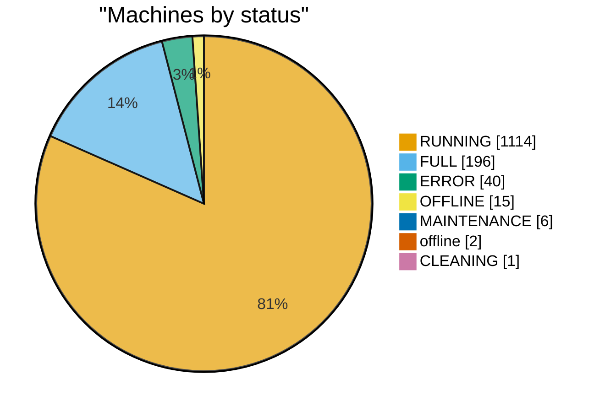
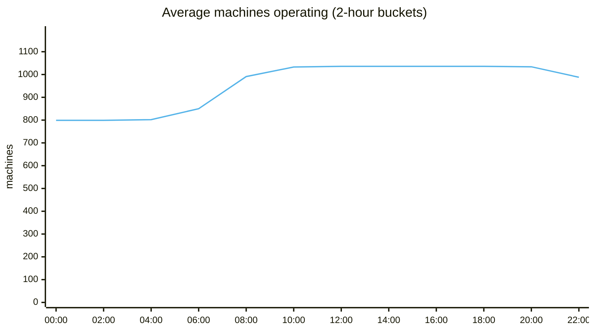
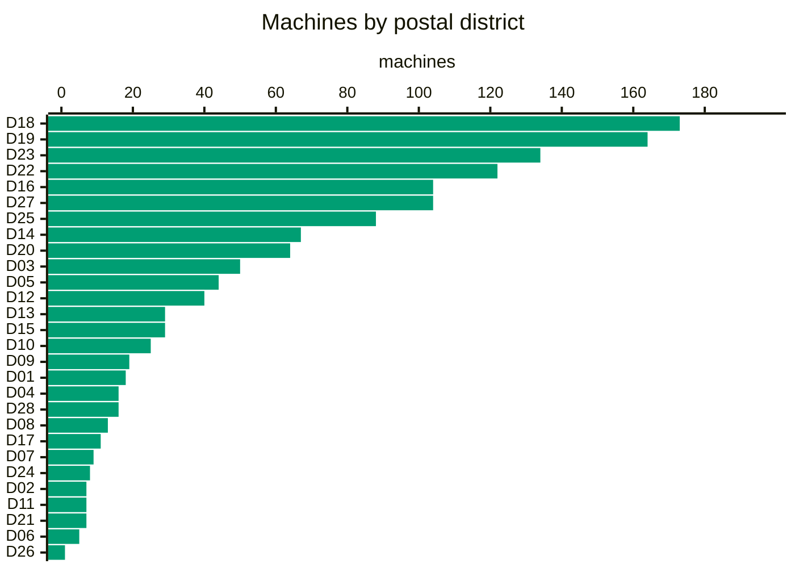
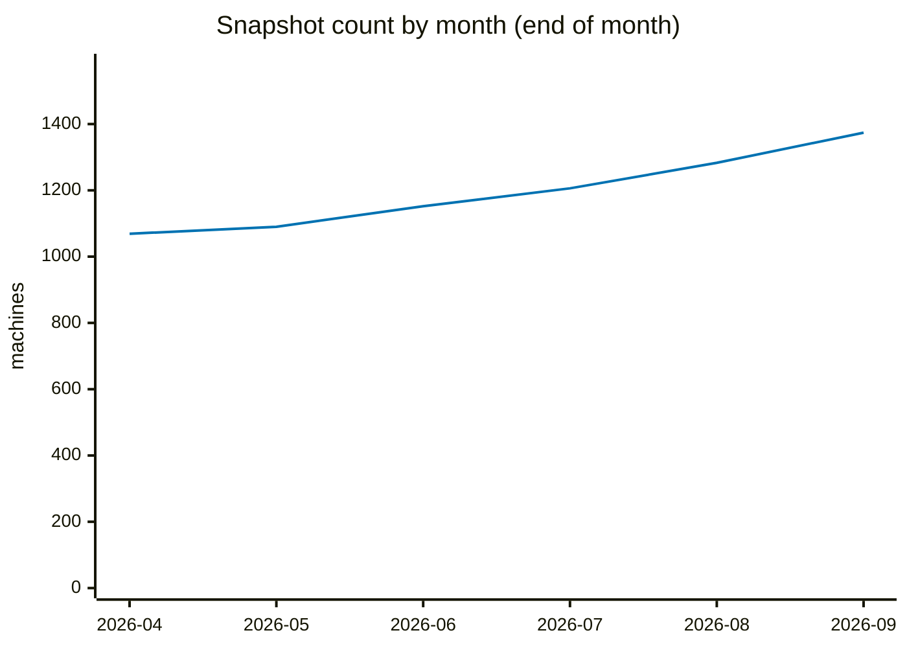
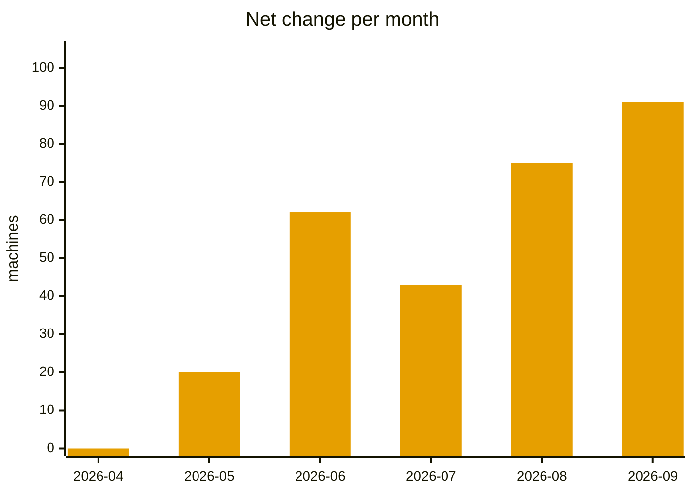

# ReturnRight data analysis

_Snapshot: **2026-09-26** · 1,374 locations · `data/latest.json` · as of 26 Sept 2026, 16:25 UTC_

## Current snapshot

| Metric | Value |
| --- | --- |
| Total locations | 1,374 |
| Unique serials | 1,374 |
| Unique postal codes | 1,327 |
| Shared postal codes | 41 postcodes host 47 extra machines |

### Status

| Status | Count | % |
| --- | --- | --- |
| RUNNING | 1,114 | 81.1% |
| FULL | 196 | 14.3% |
| ERROR | 40 | 2.9% |
| OFFLINE | 15 | 1.1% |
| MAINTENANCE | 6 | 0.4% |
| offline | 2 | 0.1% |
| CLEANING | 1 | 0.1% |

## Operation timing (opening hours)

| Coverage | Machines | % |
| --- | --- | --- |
| 24 hours | 799 | 58.2% |
| Limited hours | 237 | 17.2% |
| Unknown | 338 | 24.6% |

### Hourly availability

- Typical window: **07:00 → 23:00**
- Earliest open: **05:30**
- Latest close: **24:00**
- Peak: **1,036 machines** at **13:00**
- **237** machines with limited hours open all 7 days

## Postal sectors & districts

All postal sectors, with the Singapore postal district each belongs to:

| Sector | Postal district | Area | Machines | % |
| --- | --- | --- | --- | --- |
| S52 | D18 | Pasir Ris, Tampines | 111 | 8.1% |
| S73 | D25 | Admiralty, Woodlands, Kranji, Woodgrove | 85 | 6.2% |
| S46 | D16 | Bedok, Upper East Coast, Eastwood, Kew Drive | 76 | 5.5% |
| S76 | D27 | Yishun, Sembawang | 71 | 5.2% |
| S64 | D22 | Boon Lay, Jurong, Tuas | 63 | 4.6% |
| S51 | D18 | Pasir Ris, Tampines | 62 | 4.5% |
| S82 | D19 | Serangoon Gardens, Hougang, Punggol, Sengkang | 59 | 4.3% |
| S68 | D23 | Hillview, Dairy Farm, Bukit Panjang, Choa Chu Kang | 52 | 3.8% |
| S53 | D19 | Serangoon Gardens, Hougang, Punggol, Sengkang | 49 | 3.6% |
| S56 | D20 | Ang Mo Kio, Bishan, Thomson | 45 | 3.3% |
| S67 | D23 | Hillview, Dairy Farm, Bukit Panjang, Choa Chu Kang | 43 | 3.1% |
| S54 | D19 | Serangoon Gardens, Hougang, Punggol, Sengkang | 39 | 2.8% |
| S65 | D23 | Hillview, Dairy Farm, Bukit Panjang, Choa Chu Kang | 38 | 2.8% |
| S60 | D22 | Boon Lay, Jurong, Tuas | 35 | 2.5% |
| S75 | D27 | Yishun, Sembawang | 33 | 2.4% |
| S12 | D05 | Buona Vista, West Coast, Pasir Panjang, Clementi New Town | 31 | 2.3% |
| S47 | D16 | Bedok, Upper East Coast, Eastwood, Kew Drive | 25 | 1.8% |
| S31 | D12 | Balestier, Toa Payoh, Serangoon | 20 | 1.5% |
| S40 | D14 | Kembangan, Eunos, Paya Lebar, Geylang | 20 | 1.5% |
| S57 | D20 | Ang Mo Kio, Bishan, Thomson | 19 | 1.4% |
| S15 | D03 | Alexandra, Commonwealth, Queenstown, Tiong Bahru | 18 | 1.3% |
| S38 | D14 | Kembangan, Eunos, Paya Lebar, Geylang | 18 | 1.3% |
| S39 | D14 | Kembangan, Eunos, Paya Lebar, Geylang | 18 | 1.3% |
| S55 | D19 | Serangoon Gardens, Hougang, Punggol, Sengkang | 17 | 1.2% |
| S14 | D03 | Alexandra, Commonwealth, Queenstown, Tiong Bahru | 16 | 1.2% |
| S16 | D03 | Alexandra, Commonwealth, Queenstown, Tiong Bahru | 16 | 1.2% |
| S23 | D09 | Orchard, Cairnhill, River Valley | 16 | 1.2% |
| S61 | D22 | Boon Lay, Jurong, Tuas | 16 | 1.2% |
| S79 | D28 | Seletar, Yio Chu Kang | 15 | 1.1% |
| S32 | D12 | Balestier, Toa Payoh, Serangoon | 13 | 0.9% |
| S44 | D15 | East Coast, Marine Parade, Katong, Joo Chiat, Amber Road | 13 | 0.9% |
| S27 | D10 | Tanglin, Ardmore, Holland, Bukit Timah | 12 | 0.9% |
| S09 | D04 | Harbourfront, Telok Blangah, Sentosa | 11 | 0.8% |
| S41 | D14 | Kembangan, Eunos, Paya Lebar, Geylang | 11 | 0.8% |
| S34 | D13 | Macpherson, Potong Pasir, Braddell | 9 | 0.7% |
| S13 | D05 | Buona Vista, West Coast, Pasir Panjang, Clementi New Town | 8 | 0.6% |
| S36 | D13 | Macpherson, Potong Pasir, Braddell | 8 | 0.6% |
| S43 | D15 | East Coast, Marine Parade, Katong, Joo Chiat, Amber Road | 8 | 0.6% |
| S69 | D24 | Lim Chu Kang, Tengah | 8 | 0.6% |
| S18 | D07 | Beach Road, Bugis, Rochor, Golden Mile | 7 | 0.5% |
| S20 | D08 | Farrer Park, Serangoon Road, Little India | 7 | 0.5% |
| S24 | D10 | Tanglin, Ardmore, Holland, Bukit Timah | 7 | 0.5% |
| S33 | D12 | Balestier, Toa Payoh, Serangoon | 7 | 0.5% |
| S37 | D13 | Macpherson, Potong Pasir, Braddell | 7 | 0.5% |
| S05 | D01 | Boat Quay, Raffles Place, Marina, Cecil, People's Park | 6 | 0.4% |
| S21 | D08 | Farrer Park, Serangoon Road, Little India | 6 | 0.4% |
| S42 | D15 | East Coast, Marine Parade, Katong, Joo Chiat, Amber Road | 6 | 0.4% |
| S63 | D22 | Boon Lay, Jurong, Tuas | 6 | 0.4% |
| S81 | D17 | Changi Airport, Changi Village, Loyang | 6 | 0.4% |
| S08 | D02 | Chinatown, Tanjong Pagar, Anson | 5 | 0.4% |
| S10 | D04 | Harbourfront, Telok Blangah, Sentosa | 5 | 0.4% |
| S11 | D05 | Buona Vista, West Coast, Pasir Panjang, Clementi New Town | 5 | 0.4% |
| S17 | D06 | City Hall, Clarke Quay, High Street | 5 | 0.4% |
| S30 | D11 | Newton, Novena, Watten Estate, Thomson | 5 | 0.4% |
| S35 | D13 | Macpherson, Potong Pasir, Braddell | 5 | 0.4% |
| S01 | D01 | Boat Quay, Raffles Place, Marina, Cecil, People's Park | 4 | 0.3% |
| S03 | D01 | Boat Quay, Raffles Place, Marina, Cecil, People's Park | 4 | 0.3% |
| S26 | D10 | Tanglin, Ardmore, Holland, Bukit Timah | 4 | 0.3% |
| S50 | D17 | Changi Airport, Changi Village, Loyang | 4 | 0.3% |
| S59 | D21 | Clementi Park, Upper Bukit Timah, Ulu Pandan | 4 | 0.3% |
| S22 | D09 | Orchard, Cairnhill, River Valley | 3 | 0.2% |
| S48 | D16 | Bedok, Upper East Coast, Eastwood, Kew Drive | 3 | 0.2% |
| S58 | D21 | Clementi Park, Upper Bukit Timah, Ulu Pandan | 3 | 0.2% |
| S72 | D25 | Admiralty, Woodlands, Kranji, Woodgrove | 3 | 0.2% |
| S04 | D01 | Boat Quay, Raffles Place, Marina, Cecil, People's Park | 2 | 0.1% |
| S06 | D01 | Boat Quay, Raffles Place, Marina, Cecil, People's Park | 2 | 0.1% |
| S07 | D02 | Chinatown, Tanjong Pagar, Anson | 2 | 0.1% |
| S19 | D07 | Beach Road, Bugis, Rochor, Golden Mile | 2 | 0.1% |
| S25 | D10 | Tanglin, Ardmore, Holland, Bukit Timah | 2 | 0.1% |
| S28 | D11 | Newton, Novena, Watten Estate, Thomson | 2 | 0.1% |
| S45 | D15 | East Coast, Marine Parade, Katong, Joo Chiat, Amber Road | 2 | 0.1% |
| S62 | D22 | Boon Lay, Jurong, Tuas | 2 | 0.1% |
| S49 | D17 | Changi Airport, Changi Village, Loyang | 1 | 0.1% |
| S66 | D23 | Hillview, Dairy Farm, Bukit Panjang, Choa Chu Kang | 1 | 0.1% |
| S78 | D26 | Mandai, Upper Thomson, Springleaf | 1 | 0.1% |
| S80 | D28 | Seletar, Yio Chu Kang | 1 | 0.1% |

## History (172 snapshots · 2026-04-08 → 2026-09-26)

| Metric | Value |
| --- | --- |
| First snapshot | 1,069 |
| Current snapshot | 1,374 |
| Net change | +305 |
| Minimum | 1,069 (2026-04-08) |
| Maximum | 1,374 (2026-09-26) |
| Average | 1,168 |

### Totals across all days

| Metric | Total |
| --- | --- |
| Added | 491 |
| Removed | 191 |
| Changed | 12,522 |
| No-change days | 47 |

### Machines over time

### Monthly change

| Month | Start → End | Added | Removed | Net |
| --- | --- | --- | --- | --- |
| 2026-04 | 1,069 → 1,069 | 0 | 5 | 0 |
| 2026-05 | 1,070 → 1,090 | 21 | 0 | +20 |
| 2026-06 | 1,090 → 1,152 | 63 | 1 | +62 |
| 2026-07 | 1,163 → 1,206 | 99 | 45 | +43 |
| 2026-08 | 1,208 → 1,283 | 168 | 91 | +75 |
| 2026-09 | 1,283 → 1,374 | 140 | 49 | +91 |

### Most active days

| Date | Added | Removed | Changed | Locations |
| --- | --- | --- | --- | --- |
| 2026-09-10 | 2 | 36 | 1,305 | 1,307 |
| 2026-09-09 | 35 | 0 | 1,306 | 1,341 |
| 2026-08-14 | 32 | 0 | 4 | 1,246 |
| 2026-09-22 | 29 | 0 | 1 | 1,368 |
| 2026-08-16 | 21 | 5 | 1 | 1,237 |

**Retention:** 98.5% of the first snapshot's machines are still present (1053/1,069).

---

_Generated with `scripts/analyze_data.mjs --md`._
