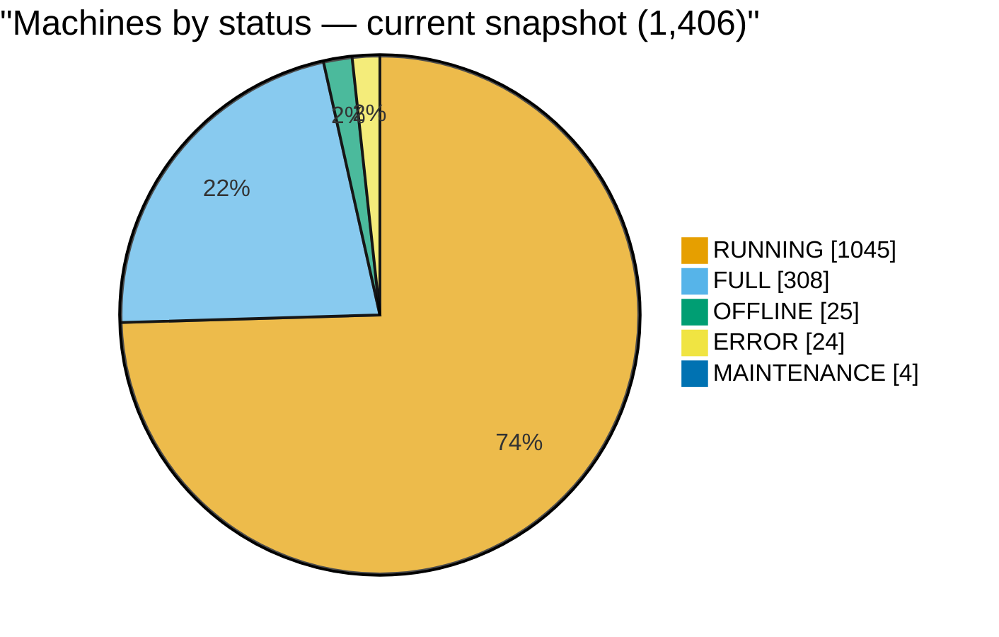
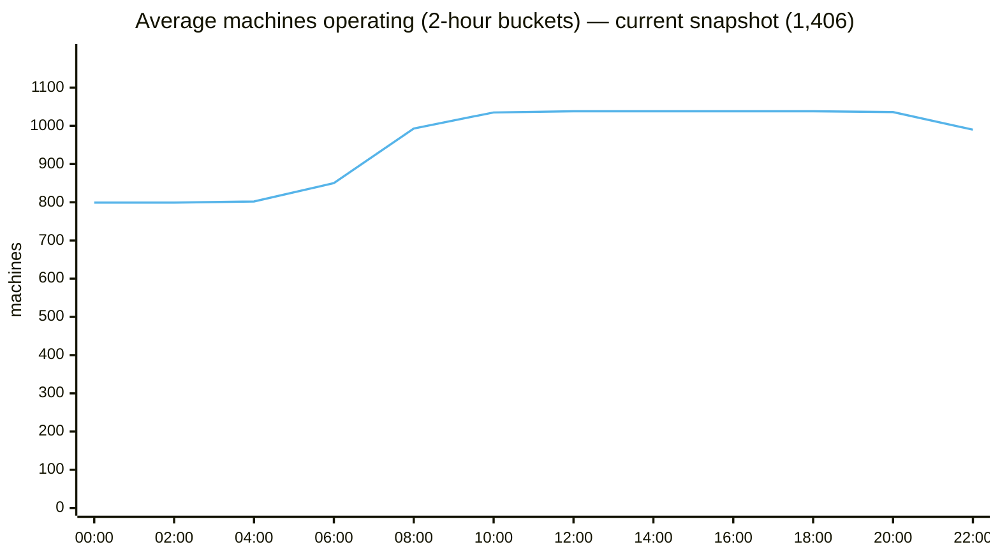
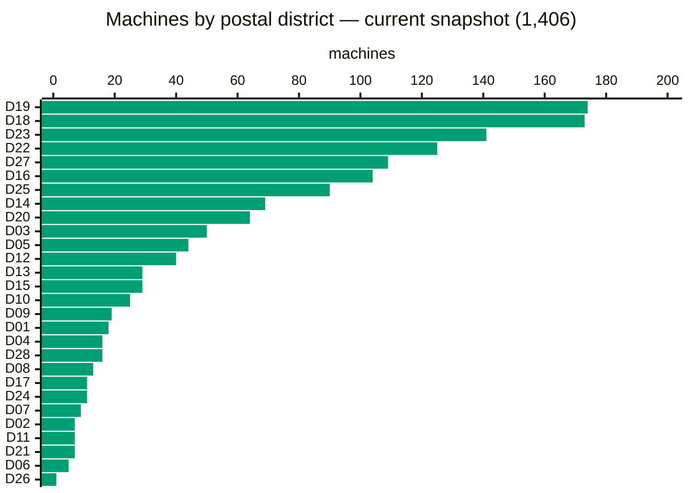
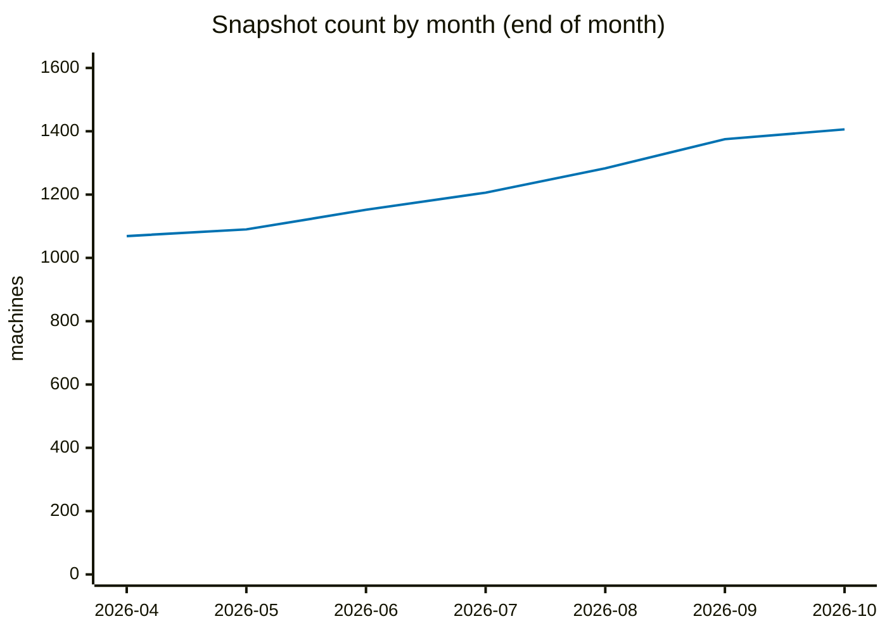
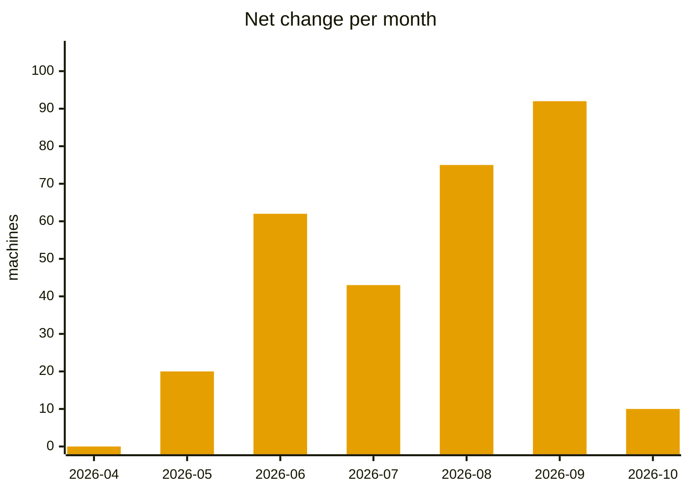

# ReturnRight data analysis

_Snapshot: **2026-10-06** · 1,406 locations · `data/latest.json` · as of 6 Oct 2026, 17:35 UTC_

## Summary

The network contains 1,406 locations across 1,358 postal codes. 74.3% are RUNNING. The network has grown by 337 locations (31.5%) since 2026-04-08. The largest postal sectors are S52 (111), S73 (86), S46 (76).

## Current snapshot

| Metric | Value |
| --- | --- |
| Total locations | 1,406 |
| Unique serials | 1,406 |
| Serial records | 1,406 |
| Duplicate serial records | 0 |
| Unique postal codes | 1,358 |
| Shared postal codes | 42 postcodes host 48 extra machines |

### Status distribution

```mermaid
---
config:
  themeVariables:
    pie1: "#E69F00"
    pie2: "#56B4E9"
    pie3: "#009E73"
    pie4: "#F0E442"
    pie5: "#0072B2"
    pie6: "#D55E00"
    pie7: "#CC79A7"
    pie8: "#999999"
---
pie showData
    title "Machines by status — current snapshot (1,406)"
    "RUNNING": 1045
    "FULL": 308
    "OFFLINE": 25
    "ERROR": 24
    "MAINTENANCE": 4
```

| Status | Count | % |
| --- | --- | --- |
| RUNNING | 1,045 | 74.3% |
| FULL | 308 | 21.9% |
| OFFLINE | 25 | 1.8% |
| ERROR | 24 | 1.7% |
| MAINTENANCE | 4 | 0.3% |

_Status values are normalized to uppercase for reporting._

## Operation timing (opening hours)

| Coverage | Machines | % |
| --- | --- | --- |
| 24-hour | 799 | 56.8% |
| Limited hours | 239 | 17.0% |
| Unknown | 368 | 26.2% |

### Hourly availability

```mermaid
---
config:
  themeVariables:
    xyChart:
      plotColorPalette: "#56B4E9"
  xyChart:
    width: 900
---
xychart-beta
    title "Average machines operating (2-hour buckets) — current snapshot (1,406)"
    x-axis ["00:00", "02:00", "04:00", "06:00", "08:00", "10:00", "12:00", "14:00", "16:00", "18:00", "20:00", "22:00"]
    y-axis "machines" 0 --> 1194
    line [799, 799, 802, 850, 993, 1035, 1038, 1038, 1038, 1038, 1036, 990]
```

- Typical window: **07:00 → 23:00**
- Earliest open: **05:30**
- Latest close: **24:00**
- Peak: **1,038 machines** at **13:00**
- **239** machines with limited hours open all 7 days

## Postal sectors & districts

```mermaid
---
config:
  themeVariables:
    xyChart:
      plotColorPalette: "#009E73"
  xyChart:
    chartOrientation: "horizontal"
    plotReservedSpacePercent: 40
---
xychart-beta
    title "Machines by postal district — current snapshot (1,406)"
    x-axis ["D19", "D18", "D23", "D22", "D27", "D16", "D25", "D14", "D20", "D03", "D05", "D12", "D13", "D15", "D10", "D09", "D01", "D04", "D28", "D08", "D17", "D24", "D07", "D02", "D11", "D21", "D06", "D26"]
    y-axis "machines" 0 --> 201
    bar [174, 173, 141, 125, 109, 104, 90, 69, 64, 50, 44, 40, 29, 29, 25, 19, 18, 16, 16, 13, 11, 11, 9, 7, 7, 7, 5, 1]
```

### Top sectors

| Sector | Postal district | Area | Machines | % |
| --- | --- | --- | --- | --- |
| S52 | D18 | Pasir Ris, Tampines | 111 | 7.9% |
| S73 | D25 | Admiralty, Woodlands, Kranji, Woodgrove | 86 | 6.1% |
| S46 | D16 | Bedok, Upper East Coast, Eastwood, Kew Drive | 76 | 5.4% |
| S76 | D27 | Yishun, Sembawang | 72 | 5.1% |
| S64 | D22 | Boon Lay, Jurong, Tuas | 65 | 4.6% |

All postal sectors, with the Singapore postal district each belongs to:

| Sector | Postal district | Area | Machines | % |
| --- | --- | --- | --- | --- |
| S52 | D18 | Pasir Ris, Tampines | 111 | 7.9% |
| S73 | D25 | Admiralty, Woodlands, Kranji, Woodgrove | 86 | 6.1% |
| S46 | D16 | Bedok, Upper East Coast, Eastwood, Kew Drive | 76 | 5.4% |
| S76 | D27 | Yishun, Sembawang | 72 | 5.1% |
| S64 | D22 | Boon Lay, Jurong, Tuas | 65 | 4.6% |
| S51 | D18 | Pasir Ris, Tampines | 62 | 4.4% |
| S82 | D19 | Serangoon Gardens, Hougang, Punggol, Sengkang | 59 | 4.2% |
| S53 | D19 | Serangoon Gardens, Hougang, Punggol, Sengkang | 58 | 4.1% |
| S68 | D23 | Hillview, Dairy Farm, Bukit Panjang, Choa Chu Kang | 53 | 3.8% |
| S56 | D20 | Ang Mo Kio, Bishan, Thomson | 45 | 3.2% |
| S65 | D23 | Hillview, Dairy Farm, Bukit Panjang, Choa Chu Kang | 44 | 3.1% |
| S67 | D23 | Hillview, Dairy Farm, Bukit Panjang, Choa Chu Kang | 43 | 3.1% |
| S54 | D19 | Serangoon Gardens, Hougang, Punggol, Sengkang | 40 | 2.8% |
| S75 | D27 | Yishun, Sembawang | 37 | 2.6% |
| S60 | D22 | Boon Lay, Jurong, Tuas | 35 | 2.5% |
| S12 | D05 | Buona Vista, West Coast, Pasir Panjang, Clementi New Town | 31 | 2.2% |
| S47 | D16 | Bedok, Upper East Coast, Eastwood, Kew Drive | 25 | 1.8% |
| S31 | D12 | Balestier, Toa Payoh, Serangoon | 20 | 1.4% |
| S40 | D14 | Kembangan, Eunos, Paya Lebar, Geylang | 20 | 1.4% |
| S57 | D20 | Ang Mo Kio, Bishan, Thomson | 19 | 1.4% |
| S15 | D03 | Alexandra, Commonwealth, Queenstown, Tiong Bahru | 18 | 1.3% |
| S38 | D14 | Kembangan, Eunos, Paya Lebar, Geylang | 18 | 1.3% |
| S39 | D14 | Kembangan, Eunos, Paya Lebar, Geylang | 18 | 1.3% |
| S55 | D19 | Serangoon Gardens, Hougang, Punggol, Sengkang | 17 | 1.2% |
| S14 | D03 | Alexandra, Commonwealth, Queenstown, Tiong Bahru | 16 | 1.1% |
| S16 | D03 | Alexandra, Commonwealth, Queenstown, Tiong Bahru | 16 | 1.1% |
| S23 | D09 | Orchard, Cairnhill, River Valley | 16 | 1.1% |
| S61 | D22 | Boon Lay, Jurong, Tuas | 16 | 1.1% |
| S79 | D28 | Seletar, Yio Chu Kang | 15 | 1.1% |
| S32 | D12 | Balestier, Toa Payoh, Serangoon | 13 | 0.9% |
| S41 | D14 | Kembangan, Eunos, Paya Lebar, Geylang | 13 | 0.9% |
| S44 | D15 | East Coast, Marine Parade, Katong, Joo Chiat, Amber Road | 13 | 0.9% |
| S27 | D10 | Tanglin, Ardmore, Holland, Bukit Timah | 12 | 0.9% |
| S09 | D04 | Harbourfront, Telok Blangah, Sentosa | 11 | 0.8% |
| S69 | D24 | Lim Chu Kang, Tengah | 11 | 0.8% |
| S34 | D13 | Macpherson, Potong Pasir, Braddell | 9 | 0.6% |
| S13 | D05 | Buona Vista, West Coast, Pasir Panjang, Clementi New Town | 8 | 0.6% |
| S36 | D13 | Macpherson, Potong Pasir, Braddell | 8 | 0.6% |
| S43 | D15 | East Coast, Marine Parade, Katong, Joo Chiat, Amber Road | 8 | 0.6% |
| S18 | D07 | Beach Road, Bugis, Rochor, Golden Mile | 7 | 0.5% |
| S20 | D08 | Farrer Park, Serangoon Road, Little India | 7 | 0.5% |
| S24 | D10 | Tanglin, Ardmore, Holland, Bukit Timah | 7 | 0.5% |
| S33 | D12 | Balestier, Toa Payoh, Serangoon | 7 | 0.5% |
| S37 | D13 | Macpherson, Potong Pasir, Braddell | 7 | 0.5% |
| S63 | D22 | Boon Lay, Jurong, Tuas | 7 | 0.5% |
| S05 | D01 | Boat Quay, Raffles Place, Marina, Cecil, People's Park | 6 | 0.4% |
| S21 | D08 | Farrer Park, Serangoon Road, Little India | 6 | 0.4% |
| S42 | D15 | East Coast, Marine Parade, Katong, Joo Chiat, Amber Road | 6 | 0.4% |
| S81 | D17 | Changi Airport, Changi Village, Loyang | 6 | 0.4% |
| S08 | D02 | Chinatown, Tanjong Pagar, Anson | 5 | 0.4% |
| S10 | D04 | Harbourfront, Telok Blangah, Sentosa | 5 | 0.4% |
| S11 | D05 | Buona Vista, West Coast, Pasir Panjang, Clementi New Town | 5 | 0.4% |
| S17 | D06 | City Hall, Clarke Quay, High Street | 5 | 0.4% |
| S30 | D11 | Newton, Novena, Watten Estate, Thomson | 5 | 0.4% |
| S35 | D13 | Macpherson, Potong Pasir, Braddell | 5 | 0.4% |
| S01 | D01 | Boat Quay, Raffles Place, Marina, Cecil, People's Park | 4 | 0.3% |
| S03 | D01 | Boat Quay, Raffles Place, Marina, Cecil, People's Park | 4 | 0.3% |
| S26 | D10 | Tanglin, Ardmore, Holland, Bukit Timah | 4 | 0.3% |
| S50 | D17 | Changi Airport, Changi Village, Loyang | 4 | 0.3% |
| S59 | D21 | Clementi Park, Upper Bukit Timah, Ulu Pandan | 4 | 0.3% |
| S72 | D25 | Admiralty, Woodlands, Kranji, Woodgrove | 4 | 0.3% |
| S22 | D09 | Orchard, Cairnhill, River Valley | 3 | 0.2% |
| S48 | D16 | Bedok, Upper East Coast, Eastwood, Kew Drive | 3 | 0.2% |
| S58 | D21 | Clementi Park, Upper Bukit Timah, Ulu Pandan | 3 | 0.2% |
| S04 | D01 | Boat Quay, Raffles Place, Marina, Cecil, People's Park | 2 | 0.1% |
| S06 | D01 | Boat Quay, Raffles Place, Marina, Cecil, People's Park | 2 | 0.1% |
| S07 | D02 | Chinatown, Tanjong Pagar, Anson | 2 | 0.1% |
| S19 | D07 | Beach Road, Bugis, Rochor, Golden Mile | 2 | 0.1% |
| S25 | D10 | Tanglin, Ardmore, Holland, Bukit Timah | 2 | 0.1% |
| S28 | D11 | Newton, Novena, Watten Estate, Thomson | 2 | 0.1% |
| S45 | D15 | East Coast, Marine Parade, Katong, Joo Chiat, Amber Road | 2 | 0.1% |
| S62 | D22 | Boon Lay, Jurong, Tuas | 2 | 0.1% |
| S49 | D17 | Changi Airport, Changi Village, Loyang | 1 | 0.1% |
| S66 | D23 | Hillview, Dairy Farm, Bukit Panjang, Choa Chu Kang | 1 | 0.1% |
| S78 | D26 | Mandai, Upper Thomson, Springleaf | 1 | 0.1% |
| S80 | D28 | Seletar, Yio Chu Kang | 1 | 0.1% |

### Concentration

| Metric | Value |
| --- | --- |
| Top 5 postal sectors | 410 (29.2%) |
| Top 10 postal sectors | 687 (48.9%) |
| Largest postal district | **D19** — 174 (12.4%) |
| Largest postcode | **698924** — 4 |
| Average machines per postal code | 1.04 |

## Data quality

| Metric | Count |
| --- | --- |
| Missing IDs | 0 |
| Duplicate IDs | 0 |
| Missing serial numbers | 0 |
| Duplicate serial records | 0 |
| Missing postal codes | 0 |
| Unknown statuses | 0 |
| Unknown opening hours | 368 |
| Unmapped postal sectors | 0 |

## History (182 snapshots · 2026-04-08 → 2026-10-06)

| Metric | Value |
| --- | --- |
| First snapshot | 1,069 |
| Current snapshot | 1,406 |
| Net change | +337 |
| Growth since first snapshot | 31.5% |
| Average net change | 1.85 locations per snapshot |
| Average locations per snapshot | 1,181 |
| Gross churn | 66.8% |
| Minimum | 1,069 (2026-04-08) |
| Maximum | 1,406 (2026-10-06) |

- Best month: **2026-09 (+92)**
- Largest removal month: **2026-08 (−91 removed)**

### Totals across all days

| Metric | Total |
| --- | --- |
| Added | 523 |
| Removed | 191 |
| Changed | 12,525 |
| No-change days | 51 |

### Machines over time

```mermaid
---
config:
  themeVariables:
    xyChart:
      plotColorPalette: "#0072B2"
---
xychart-beta
    title "Snapshot count by month (end of month)"
    x-axis ["2026-04", "2026-05", "2026-06", "2026-07", "2026-08", "2026-09", "2026-10"]
    y-axis "machines" 0 --> 1617
    line [1069, 1090, 1152, 1206, 1283, 1375, 1406]
```

### Monthly change

```mermaid
---
config:
  themeVariables:
    xyChart:
      plotColorPalette: "#E69F00"
---
xychart-beta
    title "Net change per month"
    x-axis ["2026-04", "2026-05", "2026-06", "2026-07", "2026-08", "2026-09", "2026-10"]
    y-axis "machines" 0 --> 106
    bar [0, 20, 62, 43, 75, 92, 10]
```

| Month | Start → End | Added | Removed | Net |
| --- | --- | --- | --- | --- |
| 2026-04 | 1,069 → 1,069 | 0 | 5 | 0 |
| 2026-05 | 1,070 → 1,090 | 21 | 0 | +20 |
| 2026-06 | 1,090 → 1,152 | 63 | 1 | +62 |
| 2026-07 | 1,163 → 1,206 | 99 | 45 | +43 |
| 2026-08 | 1,208 → 1,283 | 168 | 91 | +75 |
| 2026-09 | 1,283 → 1,375 | 141 | 49 | +92 |
| 2026-10 | 1,396 → 1,406 | 31 | 0 | +10 |

### Most active days

| Date | Added | Removed | Changed | Locations |
| --- | --- | --- | --- | --- |
| 2026-09-10 | 2 | 36 | 1,305 | 1,307 |
| 2026-09-15 | 2 | 8 | 1,332 | 1,334 |
| 2026-09-09 | 35 | 0 | 1,306 | 1,341 |
| 2026-09-14 | 18 | 0 | 1,322 | 1,340 |
| 2026-09-16 | 1 | 0 | 1,334 | 1,335 |

**Retention:** 98.5% of the first snapshot's machines are still present (1053/1,069).

## Methodology

- Current metrics are calculated from `data/latest.json`.
- Historical metrics use commits matching `Update snapshot for YYYY-MM-DD`.
- A location is counted as one record with an `id`.
- Postal sectors are derived from the first two digits of the postal code.
- Status values are normalized to uppercase.

---

_Generated with `scripts/analyze_data.mjs --md`._
